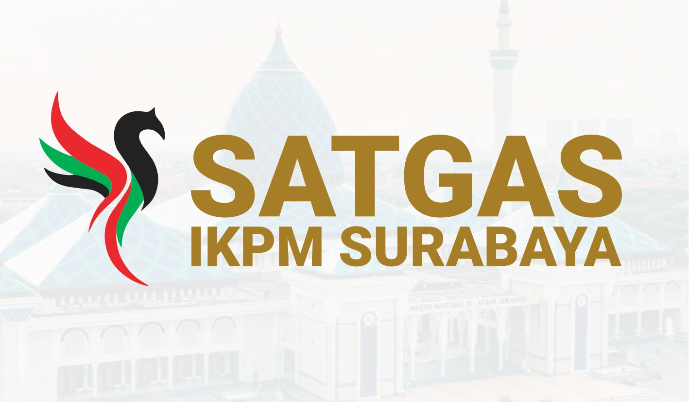

# Website Informasi Perpulangan - Arus Balik Konsulat Surabaya

Selamat Datang di Dokumentasi Web Portofolio kedua saya.
Ini merupakan web portofolio kedua yang telah saya buat dengan menggunakan framework Vite + Svelte dan Tailwind CSS.

## Framework yang digunakan

  

## Bahasa Pemrograman Yang di Gunakan

   

## Overview Web Ini

Web ini adalah web portofolio yang didalamnya terdapat pengenalan tentang diri saya dan juga data diri serta kontak saya.

Selain itu, web ini juga menjabarkan tentang kemampuan - kemampuan yang saya miliki baik itu pemrograman web, desain grafis dan juga fotografi.Di sini
juga ada link untuk mencari tahu tentang portofolio saya baik itu di Github ataupun Shutterstock.

Web ini sudah responsif sehingga tampilannya sudah bagus jika dibuka di smartphone maupun di dekstop.

